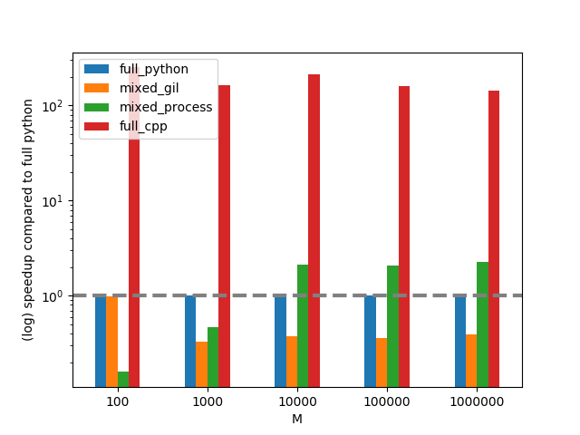
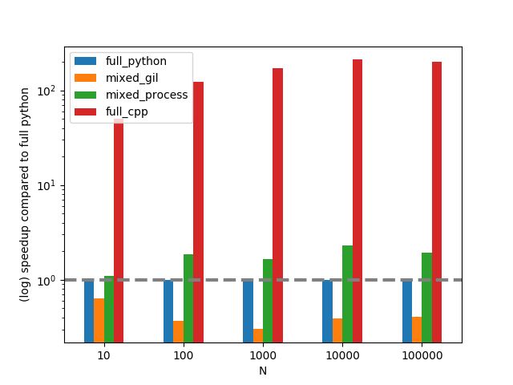

<!--
$theme: gaia
class: invert -->

<!-- _class: lead invert -->

# A simple project mixing parallel Python and C++ codes

---

# We will show...

- how to configure a platform independent project mixing Python and C++ with [cmake](https://cmake.org) and [pybind11](https://github.com/pybind/pybind11)
- how to call Python from C++ and vice versa
- how to code in modern C++ as in Python
- how to write efficient parallel code mixing C++ and Python by circumventing the GIL

---

# Requirements

- good C++ compiler with C++-17 standard support: e.g. [GCC](https://gcc.gnu.org) or [Clang](https://clang.llvm.org)
- [CMake](https://cmake.org): platform-independent configuration tool for C++
- [pybind11](https://github.com/pybind/pybind11): high-level C++ directives to call Python from C++ and vice versa; built upon cython
- [backward](https://github.com/bombela/backward-cpp): magically adds stack trace capabilities for C++ without additional code (only if project compiled in debug mode)
- [Catch2](https://github.com/catchorg/Catch2): beautiful unit tests in C++

---

# Project architecture

```bash
simple-cpp-python
    |-- CMakeLists.txt   # project configuration
    |-- code.hh          # C++ functions code
    |-- package.cc       # export C++ functions to python
    |-- tests.cc         # C++ unit tests
    |-- script.py        # python code calling C++ code
    |-- build            # created after project configuration (see next slide)
        |-- __simple_cpp_python.cpython-37m-darwin.so # C++ python extension
```

---

# Project configuration: CMakeLists.txt

```cmake
CMAKE_MINIMUM_REQUIRED(VERSION 3.10.2)
PROJECT(simple_cpp_python)

ENABLE_LANGUAGE(CXX)
SET(CMAKE_CXX_STANDARD 17)  # C++-17 required for high-level code parallelization
SET(CMAKE_CXX_STANDARD_REQUIRED ON)

FIND_PACKAGE(TBB REQUIRED)  # TBB required by GCC's implementation of C++-17
FIND_PACKAGE(pybind11 REQUIRED)
FIND_PACKAGE(Catch2 REQUIRED)

PYBIND11_ADD_MODULE(__simple_cpp_python main.cc)
TARGET_LINK_LIBRARIES(__simple_cpp_python PRIVATE ${TBB_IMPORTED_TARGETS})
ADD_BACKWARD(__simple_cpp_python)
```

---

# Configuring the project

1. Go to the directory where you installed ```simple-cpp-python```
2. Create a ```build``` directory there
3. Run the following commands (or use an IDE like visual studio code):
   ```bash
   cd build
   cmake ..  # configure the project for your platform (creates a Makefile)
   make      # compile the python extension library
   ```
You should now have a file under ```build``` called
```__simple_cpp_python.cpython-37m-darwin.so``` that you can import in Python.

---

# Selecting different python interpreters

In the previous slide, cmake via the pybind11 package (line
```FIND_PACKAGE(pybind11 REQUIRED)``` in CMakeLists.txt) automatically selects the default python interpreter of my shell.

To select a different python interpreter you need to configure with the following command:
```cmake -DPYTHON_EXECUTABLE="/path/to/my/python/interpreter" ..```

---

# Computing Lagrange's trigonometric identities

See the [Wikipedia](https://en.wikipedia.org/wiki/List_of_trigonometric_identities#Lagrange's_trigonometric_identities) page. We gonna compute:

$$ \begin{aligned}
f(\theta, N) &= \sum_{n=1}^N \sin(n \theta) + \cos(n \theta) \\
             & = \frac{1}{2} \left( \cot \left(\frac{\theta}{2}\right) - 1 + \frac{\sin \left( \left(N+\frac{1}{2}\right) \theta \right) - \cos \left( \left(N+\frac{1}{2}\right) \theta \right)}{\sin \left(\frac{\theta}{2}\right)} \right)
\end{aligned} $$
with $\theta = \frac{\pi}{8} = \sum_{k=0}^{+\infty} \frac{1}{(4k+1)(4k+3)}$

---

# Why such a dummy useless nested loops computation?

<br>
<span style="font-size:95%">
Only to show:
- the benefit of parallezing code mixing Python and C++
- how to call python (inner loop) from C++ (outer loop)

Outer loop (i.e. sum from $n=1$ to $N$) used to demonstrate parallelization (compute each element of the sum in parallel)

Overhead of parallel for loops mitigated if computation of each element of the loop takes a lot of CPU cycles --> compute $\sin(n\theta)$ and $\cos(n\theta)$ with $\theta=\frac{\pi}{8}$ as a series (inner loop).
</span>

---

# Full python code

```python
import math, operator, time, sys
from pathos import multiprocessing
from functools import reduce

def python_inner_loop(M):  # computes pi/8 as a sequential series
    return reduce(operator.add, [1 / ((4*k + 1) * (4*k + 3)) for k in range(M)], 0)

def python_outer_loop(xf, N, M):  # computes the parallel series of cos(n * theta) + sin(n * theta)
    pool = multiprocessing.Pool()
    v = pool.map(lambda n: math.cos((n+1) * xf(M)) + math.sin((n+1) * xf(M)), [n for n in range(N)])
    return reduce(operator.add, v, 0)

def full_python(N, M):
    return python_outer_loop(python_inner_loop, N, M)

if __name__ == "__main__":
    start = time.time()
    r = full_python(1000, 10000)
    end = time.time()
    print('full python result: ' + str(r) + ' in ' + str(end-start) + ' seconds')
    x = math.pi / 8
    r = 0.5 * ((1.0 / math.tan(x / 2)) - 1 + (math.sin(x * (N + 0.5)) - math.cos(x * (N + 0.5))) / math.sin(x / 2))
    print('exact result: ' + str(r))
```

---

# Full python code (cont.)

Result:
```bash
$ python script.py
full python result: 4.046217839811811 in 1.1689767837524414 seconds
exact result: 4.027339492125908
```

---

# Full C++ version

```cpp
double cpp_inner_loop(const unsigned int& M) {
    std::vector<double> v(M);
    std::iota(v.begin(), v.end(), 0);  // fills the vector v with [0, 1, 2, ..., M-1]
    std::transform(std::execution::seq, v.begin(), v.end(), v.begin(), [](const double& k){ // sequential loop
        return 1.0 / ((4*k + 1) * (4*k + 3));
    });
    return std::reduce(std::execution::seq, v.begin(), v.end(), 0.0, std::plus<>());
}

double cpp_outer_loop(const std::function<double (const unsigned int&)>& xf, const unsigned int& N, const unsigned int& M) {
    std::vector<double> v(N);
    std::iota(v.begin(), v.end(), 0);  // fills the vector v with [0, 1, 2, ..., N-1]
    std::transform(std::execution::par, v.begin(), v.end(), v.begin(), [&xf, &M](const auto& n){ // parallel loop
        return std::cos((n+1) * xf(M)) + std::sin((n+1) * xf(M));
    });
    return std::reduce(std::execution::par, v.begin(), v.end(), 0.0, std::plus<>());
}

double full_cpp(const unsigned int& N, const unsigned int& M) {
    return cpp_outer_loop(cpp_inner_loop, N, M);
}
```
<span style="font-size:75%">
Note how std::transform() is called with std::execution::seq or std::execution::par.
</span>

---

# Exporting the C++ code to python

In ```package.cc```:
```cpp
#include "code.hh"
#include <pybind11/pybind11.h>

namespace py = pybind11;

PYBIND11_MODULE(__simple_cpp_python, m) {
    m.doc() = "pybind11 example plugin"; // optional module docstring
    m.def("full_cpp", &full_cpp, "A function which computes the sum of
                                  Lagrangian's trigonometric identities - full c++");
}
```
<span style="font-size:75%">
It will compile a python extension library called __simple_cpp_python.cpython-37m-darwin.so (on MacOS) containing the full_cpp() python function.
</span>

---

# Calling the C++ code from python

In ```script.py```:
```python
import build.__simple_cpp_python as wow

if __name__ == "__main__":
    start = time.time()
    r = wow.full_cpp(1000, 10000)
    end = time.time()
    print('full c++ result: ' + str(r) + ' in ' + str(end-start) + ' seconds')
```

---

# Running the script and comparing full Python vs full C++

Result:
```bash
$ python script.py
full python result: 4.046217839811811 in 1.1679670810699463 seconds
full c++ result: 4.046217839811809 in 0.008682012557983398 seconds
exact result: 4.027339492125908
```
On this example **pure C++ is 134.53x faster than pure Python**; both using a sequential inner loop and a parallel outer loop.

---

# Mixing C++ (outer loop) and Python (inner loop)

In ```code.hh``` (```xf``` will be a Python lambda function when calling ```cpp_outer_loop_gil``` from Python):
```
double cpp_outer_loop_gil(const std::function<double (const unsigned int&)>& xf,
                          const unsigned int& N, const unsigned int& M) {
    py::gil_scoped_release release; // Release Python's GIL to enable OS multithreading
    std::vector<double> v(N);
    std::iota(v.begin(), v.end(), 0);
    std::transform(std::execution::par, v.begin(), v.end(), v.begin(), [&xf, &M](const auto& n){
        py::gil_scoped_acquire acquire;  // Acquire the GIL to prevent Python race conditions
        return std::cos((n+1) * xf(M)) + std::sin((n+1) * xf(M));  // xf() calls a Python lambda
    });
    return std::reduce(std::execution::par, v.begin(), v.end(), 0.0, std::plus<>());
}
```

---

# Calling the C++ function from Python

In ```script.py```:
```python
import build.__simple_cpp_python as wow

if __name__ == "__main__":
    start = time.time()
    r = wow.cpp_outer_loop_gil(lambda M: python_inner_loop(M), 1000, 10000)
    end = time.time()
    print('mixed result: ' + str(r) + ' in ' + str(end-start) + ' seconds')
```
In short: Python calls a C++ function that calls a long-running Python function in a parallel loop.

---

# Running the script

Result:
```bash
$ python script.py
full python result: 4.046217839811811 in 1.239090919494629 seconds
full c++ result: 4.046217839811811 in 0.009485006332397461 seconds
mixed result: 4.046217839811811 in 4.09197211265564 seconds
exact result: 4.027339492125908
```
The mixed C++/Python code is **3.3x slower** than the pure Python code! (and 431x slower than the pure C++ code)
That's because of **Python's GIL** that acts like a mutex that forces to sequentialize the C++ parallel loop...

---

# Analysis

- Python's GIL forces the outer C++ parallel loop to call each inner element in sequence
- Not happening in pure Python because full python code parallelism is implemented using *multiprocessing* instead of *multithreading* (thus circumventing the GIL)
- Solution: **call each inner Python function from a different Python process!** (but each Python inner loop running in sequence as previously)

Idea: **1 C++ thread <=> 1 Python process**

---

# C++ code calling concurrent python processes in parallel

```cpp
double cpp_outer_loop_process(const std::function<void (const unsigned int&, const unsigned int&)>& xg,
                              const std::function<double (const unsigned int&)>& xf,
                              const unsigned int& N, const unsigned int& M) {
    py::gil_scoped_release release;
    std::vector<double> v(N);
    std::iota(v.begin(), v.end(), 0);
    std::for_each(std::execution::par, v.begin(), v.end(), [&xg, &M](const auto& n){
        py::gil_scoped_acquire acquire;
        xg(n, M);  // Call to Python function that launches a detached process computing the inner loop
    });
    std::transform(std::execution::par, v.begin(), v.end(), v.begin(), [&xf](const auto& n){
        py::gil_scoped_acquire acquire;
        return std::cos((n+1) * xf(n)) + std::sin((n+1) * xf(n));  // xf(n) gets the result of xg(n, M)
    });
    return std::reduce(std::execution::par, v.begin(), v.end(), 0.0, std::plus<>());
}
```

---

# Calling the C++ function from Python

```python
def mixed_op(pool, lr, n, M):  # this our xg() viewed from C++
    lr[n] = pool.apply_async(lambda : python_inner_loop(M))  # GIL freed after launch

def mixed_get(lr, n):  # this our xf() viewed from C++
    return lr[n].get()  # blocks the process until the result is ready

if __name__ == "__main__":
    start = time.time()
    pool = multiprocessing.Pool()
    lr = [None]*N  # lr[] saves the result of each detached process
    r = wow.cpp_outer_loop_process(lambda n, M : mixed_op(pool, lr, n, M),
                                   lambda n : mixed_get(lr, n), 1000, 10000)
    end = time.time()
    print('mixed result (process): ' + str(r) + ' in ' + str(end-start) + ' seconds')
```
<span style="font-size:70%">
The GIL blocks the (only) main Python thread just to launch processes and to get their results.
</span>

---

# Running the script

```bash
$ python script.py
full python result: 4.046217839811811 in 1.1558029651641846 seconds
full c++ result: 4.046217839811814 in 0.00848531723022461 seconds
mixed result (GIL): 4.046217839811811 in 4.034562110900879 seconds
mixed result (process): 4.046217839811811 in 0.6684191226959229 seconds
exact result: 4.027339492125908
```
The mixed C++/Python process-based implementation is now **1.73x faster than the full parallel python** one (but still 78.77x slower than the full parallel C++ one...). Improvements expected to increase as inner Python code takes more CPU time.

---

# Performance analysis

Speedup vs full (parallel) Python: the higher the better (log scale)

|  |  |
|---------------------------|---------------------------|